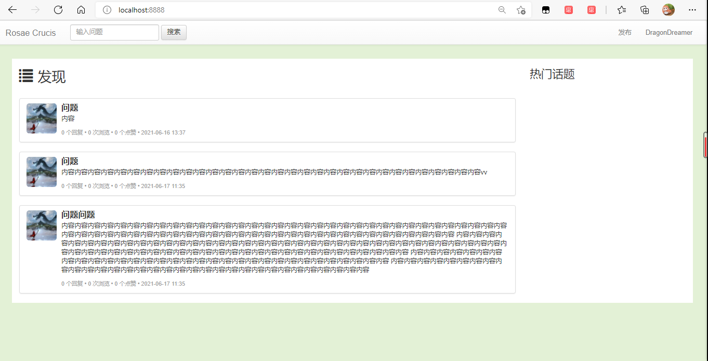

## 首页问题列表

### 1 简介

在[`0.2.0`](https://github.com/castleKing1997/community_rc/tree/0.2.0)版本中，我们编写了一个简单的问题发布页面，并将发布的问题储存在了数据库中，接下来，我们在主页对问题进行展示。



- 在主页中加入问题列表

- 从数据库中读取所有问题，显示在前端列表中

现在功能存在的问题有：

- github经常认证超时，已经尝试设置更长的`timeout`，但是仍未解决。

工作量主要几种在问题的读取和显示上，下面复习用到的技术。

### 2 问题读取

问题和用户是关联的，因此读取问题不能简单的读一个`question`表，还要读取`user`表进行关联，需要创建关联两个表的数据传输对象，并提供相应的服务对象进行关联查询，返回数据传输对象。数据传输对象之前写过了，这里这要介绍新出现的服务对象。

```java
@Service
public class QuestionService {

	@Autowired
	private QuestionMapper questionMapper;

	@Autowired
	private UserMapper userMapper;

	public List<QuestionDTO> getQuestions() {
		// 获取所有问题
		List<Question> questions = questionMapper.getQuestions();
		// 保存问题DTO
		List<QuestionDTO> questionList = new ArrayList<>();
		for (Question question : questions) {
			QuestionDTO questionDTO = new QuestionDTO();
			// 获取创建问题的用户信息
			User user = userMapper.getById(question.getCreator());
			// 将信息集合再DTO中
			BeanUtils.copyProperties(question, questionDTO);
			questionDTO.setUser(user);
			questionList.add(questionDTO);
		}
		return questionList;
	}
}

```

- BeanUtils.copyProperties：可以通过对应的getter和setter方法，从`source`中依次复制共有的变量到`target`中。

## 3 问题展示

用前端列表展示java中列表中的所有对象，需要用到thymeleaf中的`each`函数，代码片段为

```html
<ul class="list-group" th:each="question: ${questions}">
    <li class="list-group-item">
        <div class="media">
            <div class="media-left">
                <a href="#">
                    
                </a>
            </div>
            <div class="media-body">
                <h4 class="media-heading" style="font-weight: bold;" th:text="${question.title}"></h4>
                <p th:text="${question.description}"></p>
                <span class="text-desc">
                    <span th:text="${question.commentCount}"></span> 个回复 • 
                    <span th:text="${question.viewCount}"></span> 次浏览 • 
                    <span th:text="${question.likeCount}"></span> 个点赞 •
                    <span th:text="${#dates.format(question.gmtCreate,'yyyy-MM-dd HH:mm')}"></span>
                </span>
            </div>
        </div>
    </li>
</ul>
```

