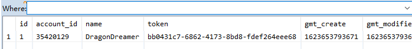
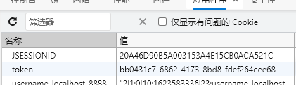
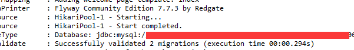

## 认证登录+数据库持久化

### 1 简介

在[0.0.0]((https://github.com/castleKing1997/community_rc/tree/0.0.0))版本中，我们完成了简单的认证登录功能，但是登录无法持久化。我们现在需要把认证过的用户信息储存在数据库里，通过在浏览器`cookie`里保存`token`的方式来保存登录状态。为此，需要实现的功能有：

- 将用户信息写入`MySQL`数据库中



- 将为用户分配的`token`保存在本地浏览器的`cookie`中



- 用户登录后，再次打开浏览器，可以获取保存的`token`，从数据库中查询登录状态，不用重新登录

- 集成`flyway`实现数据库的自动迁移

现在功能存在的问题有：

- github经常认证超时，已经尝试设置更长的`timeout`，但是仍未解决。

下面根据实现的功能，分别复习用到的技术。

### 2 @Mapper数据模型映射（功能1、2）

添加以下依赖：

```xml
<dependency>
    <groupId>org.mybatis.spring.boot</groupId>
    <artifactId>mybatis-spring-boot-starter</artifactId>
    <version>2.1.2</version>
</dependency>
<dependency>
    <groupId>mysql</groupId>
    <artifactId>mysql-connector-java</artifactId>
    <scope>runtime</scope>
</dependency>
```

- mybatis：用于和数据库交互
- mysql-connector-java：java的sql驱动

在配置文件中添加数据库连接信息：

```
spring.datasource.url=jdbc:mysql:url
spring.datasource.username=username
spring.datasource.password=password
spring.datasource.driver-class-name=com.mysql.cj.jdbc.Driver
```

创建数据模型和映射：

```java
@Mapper
public interface UserMapper {

	@Insert("INSERT INTO USER (name, account_id, token, gmt_create, gmt_modified) values (#{name},#{accountId},#{token},#{gmtCreate},#{gmtModified})")
	public void insertUser(User user);

	@Select("SELECT * FROM user WHERE token=#{token}")
	public User findByToken(@Param("token") String token);
}

```

- User：数据模型类，属性和表中的列名对应
- @Insert：插入语句，会将参数列表中`user`的属性对应到`#{}`中
- @Select：查询语句，会将`#{}`中的值和`@Param`绑定，返回属性和返回的`User`对象绑定

在控制器中将用户信息插入到数据库中

```java
@Controller
public class OAuthController {

	@Autowired
	private UserMapper userMapper;

	@GetMapping("/loginOAuth")
	public String loginOAuth(@RequestParam(name = "code") String code, @RequestParam(name = "state") String state,
			HttpServletResponse response) {
        //省略0.0.0中内容
		if (githubUser != null) {
			// 登录成功
			User user = new User();
			user.setToken(UUID.randomUUID().toString());
			user.setName(githubUser.getName());
			user.setAccountId(String.valueOf(githubUser.getId()));
			user.setGmtCreate(System.currentTimeMillis());
			user.setGmtModified(user.getGmtCreate());
			userMapper.insertUser(user);
            // 将token保存到cookie中，只需要在保存用户后执行以下3句
            userMapper.insertUser(user);
            token = user.getToken();
            response.addCookie(new Cookie("token", token));
			return "redirect:/";
		} else {
			// 登录失败
			return "redirect:/";
		}
	}
}
```

### 3 读取Cookie认证（功能3）

在进入主页时，就要认证登录状态，因此要在主页的Controller中获取：

```java
@Controller
public class IndexController {
	@Autowired
	private UserMapper userMapper;

	@GetMapping("/")
	public String index(HttpServletRequest request) {
		Cookie[] cookies = request.getCookies();
		for (Cookie cookie : cookies) {
			if (cookie.getName().equals("token")) {
				String token = cookie.getValue();
				User user = userMapper.findByToken(token);
				if (user != null) {
					request.getSession().setAttribute("user", user);
				}
				break;
			}
		}
		return "index";
	}
}
```

### 4 flyway数据迁移（功能4）

[Flyway详解以及Springboot集成Flyway（转） - 木西-Muxy - 博客园 (cnblogs.com)](https://www.cnblogs.com/muxi0407/p/11741977.html)

每次手动建表改表维护困难，因此用flyway进行管理，需要引入以下依赖：

```xml
<dependency>
    <groupId>org.flywaydb</groupId>
    <artifactId>flyway-core</artifactId>
</dependency>
```

每次启动项目时，会自动分析并执行`db/migration`中的`.sql`文件。



