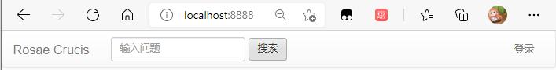
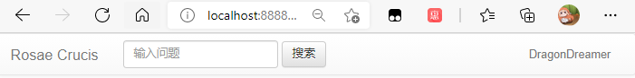

## 简单的认证登录

### 1 简介

现在已经完成了简单的登录功能，实现的功能有：

- 访问`http://localhost:port`，可以返回一个`index.html`
- `index.html`中使用`bootstrap`组件添加了一个导航栏



- 点击导航栏中的登录按钮，可以进行github的`OAuth`认证
- 登录成功后，隐藏登录按钮，转而显示一个包含用户信息的下拉菜单



现在功能存在的问题有：

- github经常认证超时，已经尝试设置更长的`timeout`，但是仍未解决。

下面根据实现的功能，分别复习用到的技术。

### 2 @Controller页面跳转（功能1）

```java
@Controller
public class IndexController {
	@GetMapping("/")
	public String index() {
		return "index";
	}
}
```

- `@GetMapping("/")`表示访问`/`时，返回以下函数的返回值

- 返回`"index"`不会直接返回字符串，而是在`templates`目录里寻找对应的html文件

### 3 Bootstrap组件（功能2）

[起步 · Bootstrap v3 中文文档 | Bootstrap 中文网 (bootcss.com)](https://v3.bootcss.com/getting-started/)

根据说明下载Bootstrap，放到`static`目录里。在用户组件里找到需要的组件，复制源码并修改。

### 4 OAuth认证（功能3）

[Authorizing OAuth Apps - GitHub Docs](https://docs.github.com/en/developers/apps/building-oauth-apps/authorizing-oauth-apps)； [OkHttp (square.github.io)](https://square.github.io/okhttp/)

```html
<li th:if="${session.user}==null"><a href="https://github.com/login/oauth/authorize/?client_id=ab40c6d1caf83749ceae&redirect_uri=http://localhost:8888/loginOAuth&scope=user&state=1">登录</a></li>
```

- 点击登录按钮后，向OAuth发请求，进行用户授权，之后跳转到`/loginOAuth`，会携带用户信息，在java里处理。

```java
@Controller
public class OAuthController {

	@Autowired
	private OAuthProvider provider;
	@Value("${github.redirect.uri}")
	private String redirectURI;
	@Value("${github.client.id}")
	private String clientID;
	@Value("${github.client.secret}")
	private String clientSecret;

	@GetMapping("/loginOAuth")
	public String loginOAuth(@RequestParam(name = "code") String code, @RequestParam(name = "state") String state,
			HttpServletRequest request) {
		AccessTokenDTO accessTokenDTO = new AccessTokenDTO();
		accessTokenDTO.setCode(code);
		accessTokenDTO.setRedirect_uri(redirectURI);
		accessTokenDTO.setClient_id(clientID);
		accessTokenDTO.setClient_secret(clientSecret);
		System.out.println("Logging...");
		String token = provider.getAccessToken(accessTokenDTO);
		System.out.println("Get Token:" + token);
		GithubUserDTO githubUser = provider.getGithutUser(token);
		System.out.println("Get User:" + JSON.toJSONString(githubUser));
		if (githubUser != null) {
			// 登录成功
			request.getSession().setAttribute("user", githubUser);
			return "redirect:/";
		} else {
			// 登录失败
			return "redirect:/";
		}
	}
}
```

- @RequestParam，会获取`url`中的对应参数，转化为java参数。

```java
@Component
public class OAuthProvider {
	public String getAccessToken(AccessTokenDTO accessTokenDTO) {
		String url = "https://github.com/login/oauth/access_token";
		MediaType mediaType = MediaType.get("application/json; charset=utf-8");
		OkHttpClient client = new OkHttpClient().newBuilder().connectTimeout(60000, TimeUnit.MILLISECONDS)
				.readTimeout(60000, TimeUnit.MILLISECONDS).build();
		RequestBody body = RequestBody.create(mediaType, JSON.toJSONString(accessTokenDTO));
		Request request = new Request.Builder().url(url).post(body).build();
		try (Response response = client.newCall(request).execute()) {
			String string = response.body().string();
			String token = string.split("&")[0].split("=")[1];
			return token;
		} catch (Exception e) {
			e.printStackTrace();
			return null;
		}
	}

	public GithubUserDTO getGithutUser(String accessToken) {
		if (accessToken == null) {
			return null;
		}
		String url = "https://api.github.com/user";
		OkHttpClient client = new OkHttpClient().newBuilder().connectTimeout(60000, TimeUnit.MILLISECONDS)
				.readTimeout(60000, TimeUnit.MILLISECONDS).build();
		Request request = new Request.Builder().url(url).header("Authorization", "token " + accessToken).build();
		try (Response response = client.newCall(request).execute()) {
			String string = response.body().string();
			GithubUserDTO githubUser = JSON.parseObject(string, GithubUserDTO.class);
			return githubUser;
		} catch (Exception e) {
			e.printStackTrace();
			return null;
		}
	}
}
```

- Request.Builder：使用okhttp向github发请求，post请求要加`body`，内容用`fastjson`从数据传输对象（DTO）转化为JSON字符串。

### 5 session参数+thymeleaf条件判断（功能4）

```html
<ul class="nav navbar-nav navbar-right">
    <li th:if="${session.user}==null"><a href="https://github.com/login/oauth/authorize/?client_id=ab40c6d1caf83749ceae&redirect_uri=http://localhost:8888/loginOAuth&scope=user&state=1">登录</a></li>
    <li th:unless="${session.user==null}" class="dropdown">
        <a href="#" class="dropdown-toggle" data-toggle="dropdown" role="button" aria-haspopup="true" aria-expanded="false" th:text="${session.user.name}"><span class="caret"></span></a>
        <ul class="dropdown-menu">
            <li><a href="#">消息中心</a></li>
            <li><a href="#">个人中心</a></li>
            <li><a href="#">退出登录</a></li>
        </ul>
    </li>
</ul>
```

- request.getSession().setAttribute：在上面的Controller中使用该方法设置了session参数，可以在thymeleaf中通过`.`访问属性（如`${session.user.name}`）
- th:if：如果条件成立，则显示该标签及其子标签
- th:unless：如果条件不成立，则显示该标签机器子标签