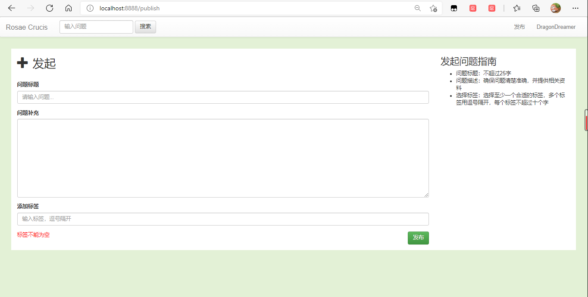

## 发布功能

### 1 简介

在之前的两个版本（[`0.0.0`](https://github.com/castleKing1997/community_rc/tree/0.0.0)、[`0.1.0`](https://github.com/castleKing1997/community_rc/tree/0.1.0)）版本中，我们基本完成了用户认证登录的功能，现在我们来完成第一个正式功能：文章发布。为此，需要实现的功能有：

- 编写一个发布页面



- 建立保存问题的数据库和java中的映射类
- 添加一个控制器，控制问题发布

现在功能存在的问题有：

- github经常认证超时，已经尝试设置更长的`timeout`，但是仍未解决。

这里几乎没有用到新技术，简单介绍一下实现。

### 2 编写页面（功能1）

```
<!DOCTYPE html>
<html xmlns:th="http://www.thymeleaf.org">
<head>
<meta http-equiv="Content-Type" content="text/html" charset="UTF-8">
<script src="https://cdn.jsdelivr.net/npm/jquery@1.12.4/dist/jquery.min.js" integrity="sha384-nvAa0+6Qg9clwYCGGPpDQLVpLNn0fRaROjHqs13t4Ggj3Ez50XnGQqc/r8MhnRDZ" crossorigin="anonymous"></script>
<link rel="stylesheet" href="css/bootstrap.min.css">
<link rel="stylesheet" href="css/bootstrap-theme.min.css">
<link rel="stylesheet" href="css/community.css">
<script src="js/bootstrap.min.js" type="application/javascript"></script>
<title>Rosae Crucis</title>
</head>
<body>
<nav class="navbar navbar-default">
  <div class="container-fluid">
    <!-- Brand and toggle get grouped for better mobile display -->
    <div class="navbar-header">
      <button type="button" class="navbar-toggle collapsed" data-toggle="collapse" data-target="#bs-example-navbar-collapse-1" aria-expanded="false">
        <span class="sr-only">Toggle navigation</span>
        <span class="icon-bar"></span>
        <span class="icon-bar"></span>
        <span class="icon-bar"></span>
      </button>
      <a class="navbar-brand" href="#">Rosae Crucis</a>
    </div>

    <div class="collapse navbar-collapse" id="bs-example-navbar-collapse-1">
      <form class="navbar-form navbar-left">
        <div class="form-group">
          <input type="text" class="form-control" placeholder="输入问题">
        </div>
        <button type="submit" class="btn btn-default">搜索</button>
      </form>
      <ul class="nav navbar-nav navbar-right">
        <li th:if="${session.user}==null"><a href="https://github.com/login/oauth/authorize/?client_id=ab40c6d1caf83749ceae&redirect_uri=http://localhost:8888/loginOAuth&scope=user&state=1">登录</a></li>
        <li th:unless="${session.user==null}"><a href="/publish">发布</a></li>
        <li th:unless="${session.user==null}" class="dropdown">
          <a href="#" class="dropdown-toggle" data-toggle="dropdown" role="button" aria-haspopup="true" aria-expanded="false" th:text="${session.user.name}"><span class="caret"></span></a>
          <ul class="dropdown-menu">
            <li><a href="#">消息中心</a></li>
            <li><a href="#">个人中心</a></li>
            <li><a href="#">退出登录</a></li>
          </ul>
        </li>
      </ul>
    </div><!-- /.navbar-collapse -->
  </div><!-- /.container-fluid -->
</nav>
<div class="container-fluid main">
  <div class="row">
  	<div class="col-lg-9 col-md-12 col-sm-12">
  		<h2><span class="glyphicon glyphicon-plus" aria-hidden="true" style="margin-right: 10px;"></span>发起</h2>
  		<br style="height:2px, color:black">
  		<form action="/publish" method="post">
			<div class="form-group">
			  <label for="title">问题标题</label>
			  <input type="text" class="form-control" name="title" id="title" placeholder="请输入问题..." th:value="${title}">
			</div>
			<div class="form-group">
			  <label for="description">问题补充</label>
			  <textarea name="description" id="description" class="form-control" cols=30 rows=10 th:text="${description}"></textarea>
			</div>
			<div class="form-group">
			  <label for="tag">添加标签</label>
			  <input type="text" class="form-control" name="tag" id="tag" placeholder="输入标签，逗号隔开" th:value="${tag}">
			</div>
			<span th:text="${error}" style="color:red"></span>
			<button type="submit" class="btn btn-success btn-publish">发布</button>
  		</form>
  	</div>
  	<div class="col-lg-3 col-md-12 col-sm-12">
  		<h3>发起问题指南</h3>
		<ul>
		  <li>问题标题：不超过25字</li>
		  <li>问题描述：确保问题清楚准确，并提供相关资料</li>
		  <li>选择标签：选择至少一个合适的标签，多个标签用逗号隔开，每个标签不超过十个字</li>
		</ul>
  	</div>
  </div>
</div>
</body>
</html>
```

- 用到了boostrap中的响应式布局，在各种大小的设备中，动态调整页面布局
- 这里直接复制了index的导航栏，不太优雅，之后会改进

## 3 建表（功能2）

```sql
CREATE TABLE `question` (
	`id` INT NOT NULL AUTO_INCREMENT,
	`title` VARCHAR(50),
	`description` TEXT,
	`tag` VARCHAR(256),
	`gmt_create` BIGINT,
	`gmt_modified` BIGINT,
	`creator` INT,
	`comment_count` INT DEFAULT '0',
	`view_count` INT DEFAULT '0',
	`like_count` INT DEFAULT '0',
	PRIMARY KEY (`id`)
);
```

- 有默认值的字段，可以不传值自动补充

## 4 控制（功能3）

```java
@Controller
public class PublishController {

	@Autowired
	private QuestionMapper questionMapper;

	// 访问提问页面
	@GetMapping("/publish")
	public String publish() {
		return "publish";
	}

	// 提交问题信息
	@PostMapping("/publish")
	public String doPublish(@RequestParam("title") String title, @RequestParam("description") String description,
			@RequestParam("tag") String tag, HttpServletRequest request, Model model) {
		// 将变量保存到当前浏览器页面中，如果发生跳转会清空
		model.addAttribute("title", title);
		model.addAttribute("description", description);
		model.addAttribute("tag", tag);
		// 判断是否填写合法
		if (title == "" || title == null) {
			model.addAttribute("error", "标题不能为空");
			return "publish";
		}
		if (description == "" || description == null) {
			model.addAttribute("error", "内容不能为空");
			return "publish";
		}
		if (tag == "" || tag == null) {
			model.addAttribute("error", "标签不能为空");
			return "publish";
		}
		// 从session中获取User对象。并转为User对象
		User user = (User) request.getSession().getAttribute("user");
		if (user == null) {
			model.addAttribute("error", "用户未登录");
			return "publish";
		}
		// 将问题插入数据库
		Question question = new Question();
		question.setTitle(title);
		question.setDescription(description);
		question.setTag(tag);
		question.setCreator(user.getId());
		question.setGmtCreate(System.currentTimeMillis());
		question.setGmtModified(question.getGmtCreate());

		questionMapper.insertQuestion(question);
		return "redirect:/";
	}
}
```

- Model会将变量保存到当前页面中，页面跳转后这些变量会清空。

